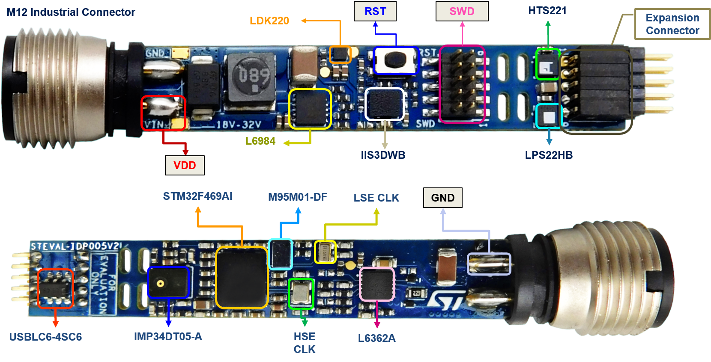

::: {.row}
::: {.col-sm-12 .col-lg-4}

# <small>Release Notes for</small> **STEVAL-BFA001Vx Board Drivers**
Copyright &copy; 2020  STMicroelectronics\
    
{.logo}

# License

This software package is licensed by ST under BSD 3-Clause license (the “License”).
You may not use this package   except in compliance with the License.
You may obtain a copy of the License at:
[BSD-3-Clause](https://opensource.org/licenses/BSD-3-Clause)

# Purpose

The BSP (Board Support Package) STEVAL-BFA001Vx Board Drivers are based on the HAL drivers and provide a set of high level APIs relative to the hardware components
and features in the evaluation board for a given STM32 processor.

The BSP drivers allow a quick access to the boards’ services using high level APIs and without any specific configuration as the link with the HAL and the external
components is done in intrinsic within the drivers.

The figure below shows the overall architecture:

Here is the list of references to user documents:

- [DB4078](https://www.st.com/resource/en/data_brief/steval-bfa001v2b.pdf) : Multi-sensor predictive maintenance kit with IO-Link stack v.1.1
- [UM2663](https://www.st.com/resource/en/user_manual/dm00671140-multisensor-predictive-maintenance-kit-with-iolink-device-stack-stmicroelectronics.pdf) : Multi-sensor predictive maintenance kit with IO-Link device stack
- [STM32Cube](https://www.st.com/stm32cube) : STM32Cube

:::

::: {.col-sm-12 .col-lg-8}
# Update History

::: {.collapse}
<input type="checkbox" id="collapse-section1" checked aria-hidden="true">
<label for="collapse-section1" aria-hidden="true">V1.0.0 / 16-November-2020</label>

	

## Main Changes

### First official release

:::
:::
:::

<footer class="sticky">
For complete documentation on **STEVAL-BFA001Vx** 
please visit: [www.st.com](https://www.st.com/content/st_com/en/products/evaluation-tools/product-evaluation-tools/mems-motion-sensor-eval-boards/steval-bfa001v2b.html)

This release note uses up to date web standards and, for this reason, should not
be opened with Internet Explorer but preferably with popular browsers such as
Google Chrome, Mozilla Firefox, Opera or Microsoft Edge.
</footer>
